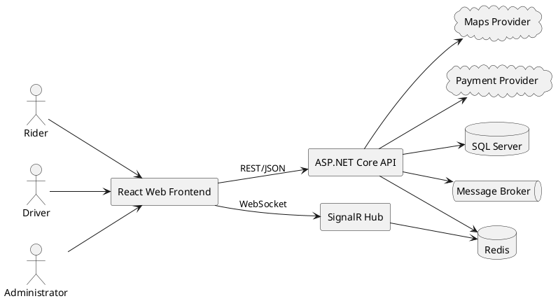
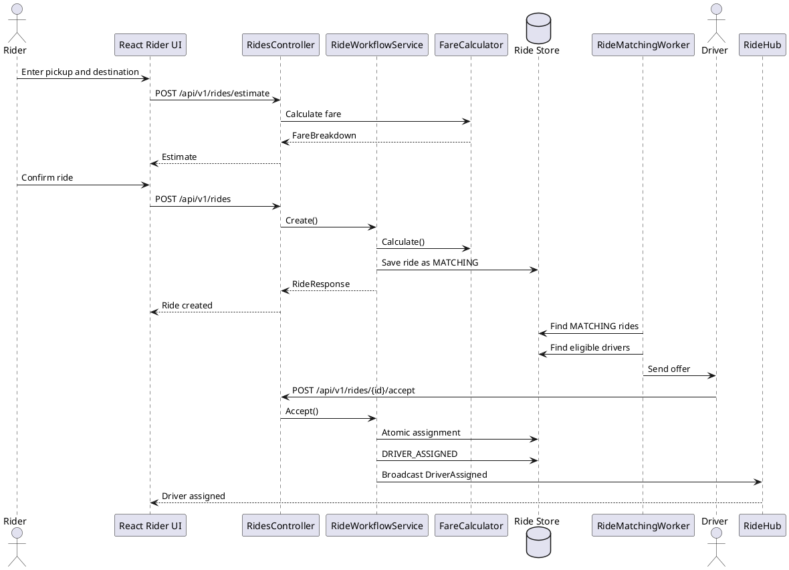
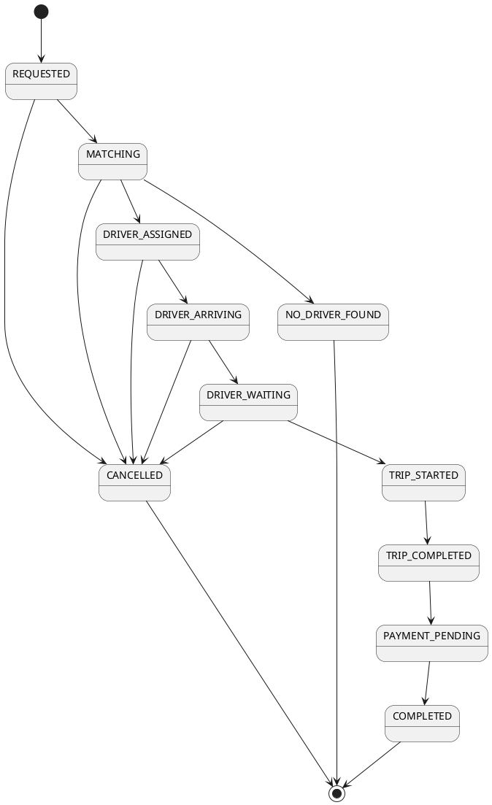
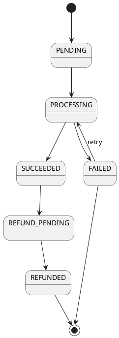
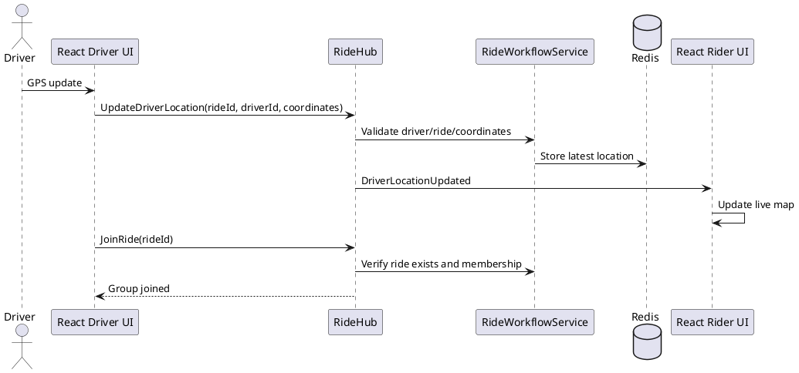
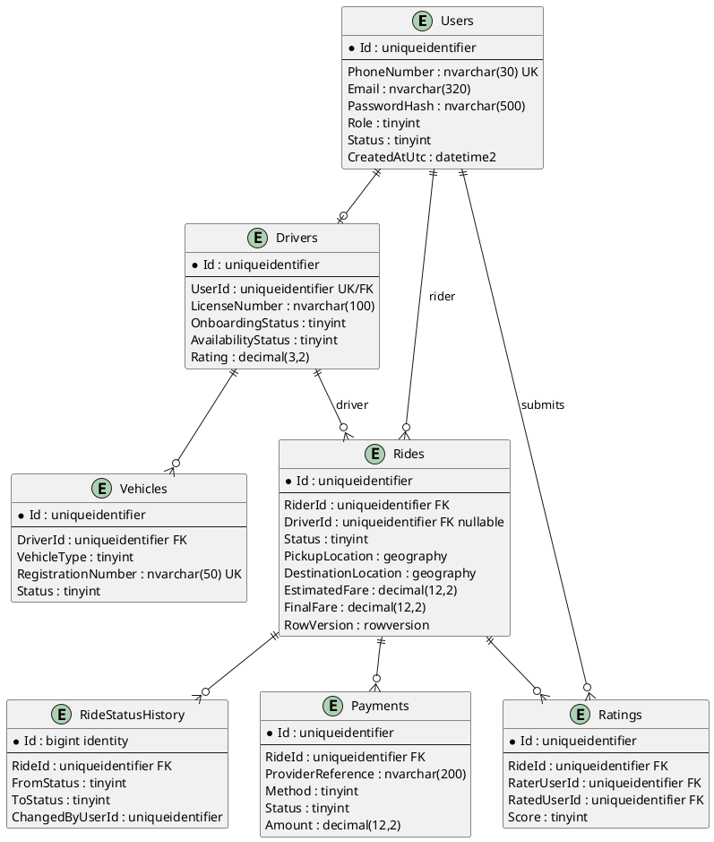
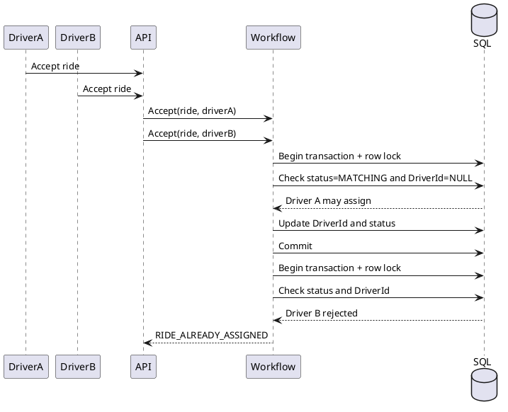

# RideHailing UML Diagrams

These diagrams describe the current modular-monolith implementation and the production target integrations. The diagrams use PlantUML and can be rendered with the PlantUML extension, `plantuml.jar`, or a compatible documentation pipeline.

## 1. System Context

## 2. Backend Components

```plantuml
@startuml
package "RideHailing.Api" {
  [AuthController]
  [RidesController]
  [DriversController]
  [AdminController]
  [RideHub]
}
package "RideHailing.Application" {
  [AuthenticationService]
  [DriverService]
  [RideWorkflowService]
  [FareCalculator]
  [IPaymentProvider]
  [ApplicationStore]
}
package "RideHailing.Domain" {
  [User]
  [DriverProfile]
  [Vehicle]
  [Ride]
  [RideOffer]
  [Payment]
  [Rating]
}
package "RideHailing.Infrastructure" {
  [RideDbContext]
  [InMemoryRideRepository]
  [FakePaymentProvider]
}
package "RideHailing.Workers" {
  [RideMatchingWorker]
  [PaymentReconciliationWorker]
  [ExpiredRideOfferWorker]
  [NotificationWorker]
  [DriverLocationCleanupWorker]
  [OutboxPublisherWorker]
}

[AuthController] --> [AuthenticationService]
[RidesController] --> [RideWorkflowService]
[DriversController] --> [DriverService]
[AdminController] --> [ApplicationStore]
[RideHub] --> [RideWorkflowService]
[AuthenticationService] --> [User]
[DriverService] --> [DriverProfile]
[DriverService] --> [Vehicle]
[RideWorkflowService] --> [Ride]
[RideWorkflowService] --> [RideOffer]
[RideWorkflowService] --> [Payment]
[RideWorkflowService] --> [Rating]
[RideWorkflowService] --> [FareCalculator]
[RideWorkflowService] --> [IPaymentProvider]
[RideWorkflowService] --> [ApplicationStore]
[RideDbContext] ..> [Ride]
[RideMatchingWorker] --> [RideWorkflowService]
[PaymentReconciliationWorker] --> [IPaymentProvider]
@enduml
```

## 3. Ride Booking and Matching Sequence

## 4. Ride Lifecycle State Machine

## 5. Payment State Machine

## 6. Driver Location and SignalR Sequence

## 7. Database Entity Relationship Diagram

## 8. Concurrent Assignment Sequence

